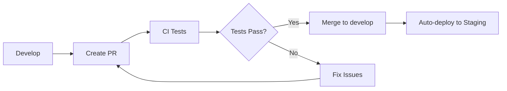
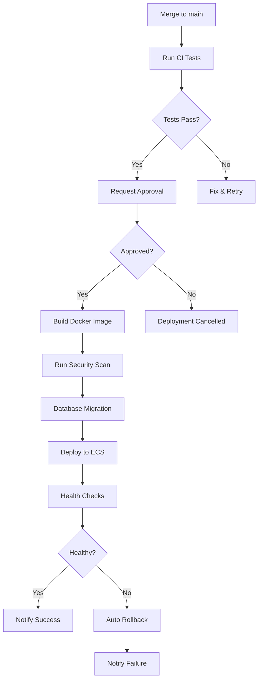

# GitHub Actions CI/CD Workflows

Automated testing, building, and deployment workflows for the Customer Success MCP system.

## Workflows Overview

### 1. CI - Continuous Integration (`ci.yml`)

**Triggers:**
- Push to `main` or `develop` branches
- Pull requests to `main` or `develop`
- Manual workflow dispatch

**Jobs:**
- **Lint**: Code quality checks (black, isort, flake8, pylint)
- **Security**: Security scanning (bandit, safety)
- **Secrets Scan**: Detect leaked secrets (gitleaks)
- **Unit Tests**: Fast, isolated tests (Python 3.9, 3.10, 3.11)
- **Integration Tests**: Tests with PostgreSQL and Redis
- **E2E Tests**: End-to-end workflow tests
- **Build**: Package validation and artifact creation
- **Docker**: Docker image build test
- **Test Summary**: Aggregate test results

**Duration:** ~10-15 minutes

**Required Secrets:**
- None (uses GitHub token automatically)

### 2. Deploy to Production (`deploy-production.yml`)

**Triggers:**
- Push to `main` branch
- Git tags matching `v*.*.*` pattern
- Manual workflow dispatch

**Jobs:**
1. **Validate**: Pre-deployment approval gate
2. **Test**: Full test suite execution
3. **Security Scan**: Trivy vulnerability scanning
4. **Build**: Build and push Docker image to ECR
5. **Migrate**: Run database migrations with backup
6. **Deploy**: Deploy to Amazon ECS
7. **Health Check**: Post-deployment validation
8. **Notify**: Slack notifications
9. **Rollback**: Automatic rollback on failure (requires approval)

**Duration:** ~20-30 minutes

**Required Secrets:**
- `AWS_ACCESS_KEY_ID`: AWS access key
- `AWS_SECRET_ACCESS_KEY`: AWS secret key
- `BACKUP_BUCKET`: S3 bucket for backups
- `PRODUCTION_URL`: Production endpoint URL
- `SLACK_WEBHOOK_URL`: Slack webhook for notifications

**Required GitHub Environments:**
- `production-approval`: Manual approval for production
- `production`: Production deployment
- `production-rollback`: Rollback approval

### 3. Deploy to Staging (`deploy-staging.yml`)

**Triggers:**
- Push to `develop` branch
- Manual workflow dispatch

**Jobs:**
1. **Test**: Run test suite
2. **Build and Deploy**: Build image and deploy to staging ECS
3. **Health Check**: Verify staging deployment
4. **Notify**: Slack notification

**Duration:** ~10-15 minutes

**Required Secrets:**
- `AWS_ACCESS_KEY_ID`: AWS access key
- `AWS_SECRET_ACCESS_KEY`: AWS secret key
- `STAGING_URL`: Staging endpoint URL
- `SLACK_WEBHOOK_URL`: Slack webhook

## Setup Instructions

### 1. Create GitHub Environments

Navigate to **Settings > Environments** and create:

#### Production Approval Environment
```
Name: production-approval
Protection rules:
  ✓ Required reviewers (1-2 people)
  ✓ Wait timer: 0 minutes
```

#### Production Environment
```
Name: production
Protection rules:
  ✓ Required reviewers (1-2 people)
Environment secrets:
  - AWS_ACCESS_KEY_ID
  - AWS_SECRET_ACCESS_KEY
  - BACKUP_BUCKET
  - PRODUCTION_URL
  - SLACK_WEBHOOK_URL
```

#### Production Rollback Environment
```
Name: production-rollback
Protection rules:
  ✓ Required reviewers (1-2 people)
  ✓ Wait timer: 5 minutes
```

#### Staging Environment
```
Name: staging
Environment secrets:
  - AWS_ACCESS_KEY_ID
  - AWS_SECRET_ACCESS_KEY
  - STAGING_URL
  - SLACK_WEBHOOK_URL
```

### 2. Configure Repository Secrets

Navigate to **Settings > Secrets and variables > Actions**:

#### Required Secrets
```bash
# AWS Credentials
AWS_ACCESS_KEY_ID: <your_aws_access_key>
AWS_SECRET_ACCESS_KEY: <your_aws_secret_key>

# S3 Backup Bucket
BACKUP_BUCKET: cs-mcp-backups

# Application URLs
PRODUCTION_URL: https://api.yourcompany.com
STAGING_URL: https://staging.yourcompany.com

# Slack Notifications
SLACK_WEBHOOK_URL: https://hooks.slack.com/services/YOUR/WEBHOOK/URL
```

### 3. Configure AWS Resources

#### Create ECR Repositories
```bash
# Production
aws ecr create-repository \
    --repository-name cs-mcp \
    --region us-east-1

# Staging
aws ecr create-repository \
    --repository-name cs-mcp-staging \
    --region us-east-1
```

#### Create ECS Cluster and Service
```bash
# Create cluster
aws ecs create-cluster \
    --cluster-name cs-mcp-cluster \
    --region us-east-1

# Create task definition (see deployment/ecs-task-definition.json)
aws ecs register-task-definition \
    --cli-input-json file://deployment/ecs-task-definition.json

# Create service
aws ecs create-service \
    --cluster cs-mcp-cluster \
    --service-name cs-mcp-service \
    --task-definition cs-mcp-task \
    --desired-count 2 \
    --launch-type FARGATE \
    --network-configuration "awsvpcConfiguration={subnets=[subnet-xxx],securityGroups=[sg-xxx],assignPublicIp=ENABLED}"
```

#### Create Secrets Manager Entries
```bash
# Database credentials
aws secretsmanager create-secret \
    --name cs-mcp/production/database \
    --secret-string '{
        "username": "cs_mcp_app",
        "password": "strong_password",
        "host": "prod-db.example.com",
        "port": 5432,
        "database": "cs_mcp_production"
    }'
```

### 4. IAM Permissions

Create IAM user/role for GitHub Actions with these policies:

```json
{
  "Version": "2012-10-17",
  "Statement": [
    {
      "Effect": "Allow",
      "Action": [
        "ecr:GetAuthorizationToken",
        "ecr:BatchCheckLayerAvailability",
        "ecr:GetDownloadUrlForLayer",
        "ecr:BatchGetImage",
        "ecr:PutImage",
        "ecr:InitiateLayerUpload",
        "ecr:UploadLayerPart",
        "ecr:CompleteLayerUpload"
      ],
      "Resource": "*"
    },
    {
      "Effect": "Allow",
      "Action": [
        "ecs:DescribeServices",
        "ecs:DescribeTaskDefinition",
        "ecs:RegisterTaskDefinition",
        "ecs:UpdateService"
      ],
      "Resource": "*"
    },
    {
      "Effect": "Allow",
      "Action": [
        "secretsmanager:GetSecretValue",
        "secretsmanager:DescribeSecret"
      ],
      "Resource": "arn:aws:secretsmanager:us-east-1:*:secret:cs-mcp/*"
    },
    {
      "Effect": "Allow",
      "Action": [
        "s3:PutObject",
        "s3:GetObject"
      ],
      "Resource": "arn:aws:s3:::cs-mcp-backups/*"
    }
  ]
}
```

## Deployment Process

### Development Workflow



### Production Deployment



### Manual Deployment

For emergency deployments or specific version deployments:

1. **Navigate to Actions tab**
2. **Select "Deploy to Production" workflow**
3. **Click "Run workflow"**
4. **Select branch/tag**
5. **Click "Run workflow" button**
6. **Wait for approval**
7. **Monitor deployment progress**

## Monitoring Deployments

### View Deployment Status

1. **GitHub Actions tab**: Real-time workflow progress
2. **ECS Console**: Service deployment status
3. **CloudWatch Logs**: Application logs
4. **Slack notifications**: Deployment updates

### Check Deployment Health

```bash
# Production health
curl https://api.yourcompany.com/health

# Staging health
curl https://staging.yourcompany.com/health

# AWS ECS service status
aws ecs describe-services \
    --cluster cs-mcp-cluster \
    --services cs-mcp-service
```

## Rollback Procedures

### Automatic Rollback

If health checks fail post-deployment, the workflow automatically triggers rollback (requires approval).

### Manual Rollback

**Option 1: Via GitHub Actions**
```
1. Go to failed deployment run
2. Navigate to "rollback" job
3. Approve rollback
```

**Option 2: Via AWS Console**
```
1. Open ECS Console
2. Navigate to cs-mcp-cluster > cs-mcp-service
3. Click "Update Service"
4. Select previous task definition revision
5. Click "Skip to review" → "Update Service"
```

**Option 3: Via AWS CLI**
```bash
# List recent task definitions
aws ecs list-task-definitions \
    --family-prefix cs-mcp-task \
    --sort DESC --max-items 5

# Rollback to previous version
aws ecs update-service \
    --cluster cs-mcp-cluster \
    --service cs-mcp-service \
    --task-definition cs-mcp-task:PREVIOUS_REVISION \
    --force-new-deployment
```

## Troubleshooting

### CI Tests Failing

**Problem**: Tests fail in CI but pass locally

**Solutions**:
```bash
# 1. Check Python version matches CI (3.10)
python --version

# 2. Run tests with same settings as CI
pytest tests/ -v --cov=src --cov-fail-under=60

# 3. Check environment variables
export ENVIRONMENT=test
export DB_HOST=localhost

# 4. Clear cache and retry
pytest --cache-clear
```

### Docker Build Failures

**Problem**: Docker image build fails

**Solutions**:
```bash
# Test build locally
docker build -t cs-mcp:test .

# Check Dockerfile syntax
docker build --no-cache -t cs-mcp:test .

# View build logs
docker build -t cs-mcp:test . --progress=plain
```

### Deployment Timeouts

**Problem**: ECS deployment times out

**Solutions**:
1. Check ECS task logs in CloudWatch
2. Verify health check endpoint responds
3. Check security groups allow traffic
4. Verify IAM task role has required permissions
5. Check task definition resource limits

### Database Migration Failures

**Problem**: Alembic migrations fail

**Solutions**:
```bash
# 1. Check current migration state
alembic current

# 2. View migration history
alembic history

# 3. Generate SQL for inspection (don't execute)
alembic upgrade head --sql

# 4. Manually connect and check
psql -h prod-db.example.com -U cs_mcp_app -d cs_mcp_production

# 5. Check migration backup exists
aws s3 ls s3://cs-mcp-backups/migrations/
```

### Health Check Failures

**Problem**: Health checks fail after deployment

**Solutions**:
1. **Check logs**: `aws logs tail /ecs/cs-mcp-service --follow`
2. **Test health endpoint directly**: `curl https://api.yourcompany.com/health`
3. **Verify environment variables**: Check ECS task definition
4. **Check database connectivity**: Verify RDS security groups
5. **Verify secrets**: Ensure Secrets Manager values are correct

## Best Practices

### Before Merging

- [ ] All tests pass locally
- [ ] Code reviewed by at least 1 person
- [ ] Database migrations tested
- [ ] Documentation updated
- [ ] Breaking changes communicated

### During Deployment

- [ ] Monitor #deployments Slack channel
- [ ] Watch CloudWatch logs
- [ ] Check error rates in Prometheus/Grafana
- [ ] Be ready to rollback if issues occur

### After Deployment

- [ ] Verify health checks pass
- [ ] Check key metrics (response time, error rate)
- [ ] Test critical user workflows
- [ ] Monitor for 15-30 minutes
- [ ] Document any issues encountered

## Security Considerations

1. **Never commit secrets** to repository
2. **Use GitHub Environments** for production deployments
3. **Require approvals** for production changes
4. **Rotate credentials** regularly (quarterly)
5. **Enable branch protection** on main/develop
6. **Review security scan** results before deployment
7. **Audit deployment logs** monthly

## Metrics and Monitoring

### Key Metrics to Track

- Deployment frequency
- Deployment success rate
- Mean time to recovery (MTTR)
- Change failure rate
- Lead time for changes

### Deployment Dashboard

Create a dashboard tracking:
- Recent deployments (last 7 days)
- Success vs failure rate
- Average deployment time
- Rollback frequency
- Test coverage trends

## Support and Escalation

### Deployment Issues

**Level 1 - Developer**: Check workflow logs, retry failed jobs
**Level 2 - DevOps**: AWS infrastructure, ECS troubleshooting
**Level 3 - On-call SRE**: Production incidents, emergency rollback

### Contacts

- **DevOps Team**: #devops-support
- **On-call SRE**: PagerDuty escalation
- **Database Admin**: #database-team
- **Security Team**: #security (for secret leaks)

## Additional Resources

- [AWS ECS Documentation](https://docs.aws.amazon.com/ecs/)
- [GitHub Actions Documentation](https://docs.github.com/en/actions)
- [Docker Best Practices](https://docs.docker.com/develop/dev-best-practices/)
- [Alembic Migrations](https://alembic.sqlalchemy.org/)
